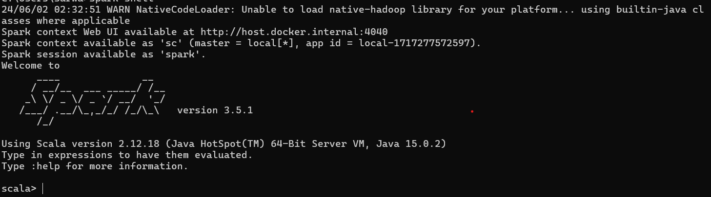

# pyspark-practise

A comprehensive guide and practice repository for learning PySpark, covering installation, setup, data transformation, 
and running Spark on the Cloud.

# What is Apache Spark?
Apache Spark is an open-source software framework built on top of the Hadoop distributed processing framework.
It provides an in-memory data processing, adaptability and scalability and high-level APIs for JAVA, Python, R
and Scala. This makes it a better choice than the previous big data processing tools like Hadoop. It also supports a 
rich set of higher-level tools, including Spark SQL for SQL and structured data processing, MLlib for 
machine learning, GraphX for graph processing, and Spark Streaming. 

**Hardware Requirements** 

Apache Spark uses local disks to store data and to preserve intermediate output. 
Having 4-8 disks per node, configured without RAID, is ideal. (RAID is a data storage virtualization 
technology that combines multiple physical disk drive components into one or more 
logical units for the purposes of data redundancy, performance improvement, or both.)
Spark requires more than 8 GB memory per machine. Generally, 75% of the memory is kept for Spark and 
the rest for the operating system and buffer cache. 
In an enterprise environment, using a 10 Gigabit or higher network is the best. 
You should likely have at least 8-16 cores per machine in production environment. 

**Software Requirements**
Spark requires an OS like Windows, Linux or Mac OS. It also requires JAVA installed on the system PATH.
It also requires either sbt, gradle or mvn to build a Spark project. For windows, we need winutils executables.  
 

In this project, 
we will be working on the following modules to have a basic level understanding of Spark and PySpark. 

1. **Install and set up Spark** 
Install Spark standalone on a machine, configure environment variables install PySpark using pip. 
2. **Execute commands on the Spark interactive shell\PySpark**
Performing basic data read, write, and transform operations on the Spark shell\pyspark
3. **Use RDDs in Spark 3** 
Performing in-memory transformations using lambdas, converting RDDs to Data Frames.
4. **Use Data Frames in Spark 3**
Reading and writing data using Data Frames (Datasets in Scala).
5. **Perform transformations and actions on data**
Performing grouping, aggregations on data, ordering data.
6. **Submit and run a job on a Spark cluster**
Using spark-submit to run long-running jobs on a Spark cluster.
7. **Create and use shared variables in Spark** 
Use broadcast variables and accumulators. 
8. **Monitor Spark jobs**
View scheduler stages, tasks, executor information. 
9. **Run Spark on the Cloud** 
Set up Spark on Amazon EMR, Azure HDInsight, and Google Cloud Dataproc and run Spark jobs.

# Initial Setup
We need to first setup a separate conda environment for this repository on PyCharm using the following command. 
`conda create --name pyspark-practise python=3.10` and then activate the conda environment 
using `conda activate pyspark-practise`

# 1.Install and set up Spark
1. Open Windows Powershella and type `JAVA --version` to make sure JAVA is installed on your system. If not, 
go to the official website of JAVA, download and install it. 
2. Go to https://spark.apache.org/downloads.html, choose `Pre-built for Apache Hadoop 3.3 and later` and 
download spark. Once downloaded, unzip the contents and copy it.
3. Create a folder called `Spark` in `C:\Users\<User-Name>\Spark` and paste the content from the previous step. 
4. We can update spark settings to reduce the amount of logging to just a WARN or an Error in order to remove 
irrelevant information in the logs during spark development. For this purpose, go to `C:\Users\<User-Name>\Spark\Conf` 
and open `log4j2.properties.template` in an editor. Set `rootlogger.level` from `info` to `WARN`. 
5. We need to remove `.template` from all files in `Conf` folder in order for spark to pick up user defined configurations
instead of default ones. 
6. Now we need to configure path for Spark in Environment Variables. 
Go to Control Panel -> System and Security -> System -> Advanced Settings -> Environment Variables. 
7. Add a new user variable, `SPARK_HOME` and give the path of the Spark folder. Then add `%SPARK_HOME%\bin` in 
path variable. 
8. Spark needs a piece of Hadoop to run. For Hadoop 2.7, we would need winutils.exe which can be downloaded 
from here https://github.com/steveloughran/winutils/blob/master/hadoop-2.7.1/bin/winutils.exe and added on 
`C\winutils`. We also need to add user variable `HADOOP_HOME` with this path as value in Environment Variables and 
then add it in Path variable as well.
9. We need to add path for JAVA in a new user variable i.e. `JAVA_HOME` with value `C:\Program Files\Java\jdk-<version_you_installed>` 
and add it to the path variable as well.
10. Now we need to test the installation by opening Command Prompt and typing `spark-shell`. 

11. Let's install PySpark using `pip install pyspark`. Add PYSPARK_PYTHON in edit configurations in case it gives 
an error while executing a pyspark script. 
